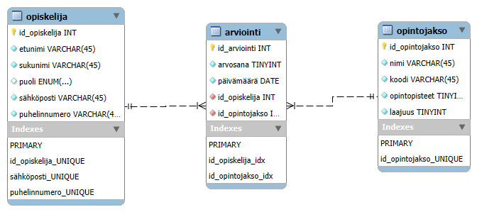

# Opintorekisteri REST API
This project is a REST API for managering a student system that named "Opintorekisteri" using MySQL,Node.js and Express,following the MVC architecture.
## Technologies used
* Backend: Node.js and Express  
* Databese: MySQL includes MySQL Stored Procedure  
* Architecture: MVC
* Test: Postman 
* CORS middleware  
* Version control:Git and Github
## Database
The project uses a MySQL relational database that includs three tables:  
### tables
#### opiskelija` (Student)
- `id_opiskelija` (PK)
- `etunimi`
- `sukunimi`
- `puoli`
- `sähköposti`
- `puhelinnumero`
#### `opintojakso` (Course)
- `id_opintojakso` (PK)
- `nimi`
- `laajuus`  
- `laajuus` 
#### `arviointi` (Grade)
- `id_arviointi` (PK)
- `arvosana` 
- `päivämäärä` 
- `id_opiskelija` (FK)
- `id_opintojakso` (FK)
### Entity-Relationship Diagram

### create MySQL user
user name:alex  
password:Alex@123456  
database:opintorekisteri  
privileges:all
### Features
- **Create** new records to the database
- **Read** data from all tables
- **Update** existing records
- **Delete** records by ID
### Store procedure  
This project includes a stored procedure written in MySQL to retrieve all grades of a specific student.
You can call it in SQL like this:
**CALL hae_opiskelija_arvosana(1);**  
This procedure retrieves a list of etunimi, sukunimi, opintojaksonimi, arvosana and päivämäärä for a given student. It joins three tables to display the full information.  
